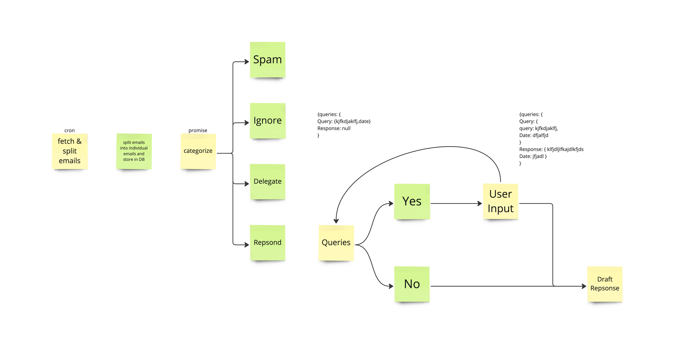

# ExCEO.ai


ExCEO.ai is an AI-powered email management tool designed specifically for executives. It leverages advanced language models to prioritize emails, summarize lengthy threads, and automate routine responses. By integrating company and user-specific insights, ExCEO.ai aims to streamline executive communication, reducing the time spent on email management by up to 60%.

## Table of Contents

- [Tech Stack](#tech-stack)
- [Getting Started](#getting-started)
  - [Prerequisites](#prerequisites)
  - [Installation](#installation)
- [Project Structure](#project-structure)
- [Features](#features)
- [Database](#database)
- [License](#license)
- [Contact](#contact)

## Tech Stack

ExCEO.ai is built using the following technologies:

- **Next.js**: Framework for server-rendered React applications using the App Router.
- **TypeScript**: For type-safe application code.
- **LangChain's LangGraph**: For large language model (LLM) orchestration and complex logic.
- **Vercel AI SDK**: For building generative UI components.
- **OpenAI API** or **Ollama**: For leveraging large language models.
- **Upstash** or **Vercel PG Vector**: Vector databases for storing embeddings.
- **Vercel**: Deployment pipeline and hosting platform for the application and edge functions.
- **ESLint**: Ensuring code quality and formatting standards.
- **Git** and **GitHub**: For version control and collaboration.

## Getting Started

### Prerequisites

Before you begin, ensure you have met the following requirements:

- **Node.js** (version 14 or later)
- **npm**, **yarn**, **pnpm**, or **bun** installed
- **Git** installed on your machine
- Access to the **OpenAI API** (if using OpenAI) or **Ollama**

### Installation

1. **Clone the Repository**

   ```bash
   git clone https://github.com/durichitayat/exceo.git
   cd exceo
   ```

2. **Install Dependencies**

   Using npm:

   ```bash
   npm install
   ```

   Or using yarn:

   ```bash
   yarn install
   ```

   Or using pnpm:

   ```bash
   pnpm install
   ```

   Or using bun:

   ```bash
   bun install
   ```

3. **Set Up Environment Variables**

   Create a `.env.local` file in the root directory and add the necessary environment variables:

   ```bash
   npm i -g vercel
    vercel env pull
   ```

4. **Run the Development Server**

   Using npm:

   ```bash
   npm run dev
   ```

   Or using yarn:

   ```bash
   yarn dev
   ```

   Or using pnpm:

   ```bash
   pnpm dev
   ```

   Or using bun:

   ```bash
   bun dev
   ```

5. **Access the Application**

   Open [http://localhost:3000](http://localhost:3000) in your browser to view the application.

## Project Structure

This project uses the Next.js **App Router**, providing a new way to structure your application.

```plaintext
exceo/
├── app/
│   ├── api/
│   │   └── ...           # API routes
│   ├── page.tsx          # Main page of the application
│   ├── layout.tsx        # Application layout
│   └── ...               # Other pages and components
├── components/
│   └── ...               # Reusable React components
├── lib/
│   └── ...               # Utilities and helper functions
├── public/
│   └── ...               # Static assets (images, icons)
├── styles/
│   └── ...               # Global and component-specific styles
├── .eslintrc.js          # ESLint configuration
├── tsconfig.json         # TypeScript configuration
├── package.json          # Project scripts and dependencies
├── README.md             # Project documentation
└── ...                   # Other configuration and setup files
```

- **app/**: Contains the Next.js App Router pages and layouts.
- **components/**: Reusable React components used throughout the application.
- **lib/**: Utility functions, API clients, and other library code.
- **public/**: Static files served directly, such as images and icons.
- **styles/**: CSS and styling files for the application.

## Features

- **Email Prioritization and Triage**: AI-driven sorting of emails based on urgency, business impact, and personal importance.
- **Automated Responses**: Generation of draft replies for routine inquiries using personalized context.
- **Thread Summarization**: Real-time summaries of lengthy email chains for quick comprehension.
- **Digest Reports**: Daily and weekly AI-generated summaries highlighting key emails and required actions.
- **Integration with Enterprise Systems**: Inclusion of relevant business data in responses.

## Database

- **NEON Postgres** <https://neon.tech/docs/get-started-with-neon/query-with-neon-sql-editor>
- **Connect with NEON Serverless Driver**

to run migrations whenever you make changes to your schema. You can do this by modifying the `lib/schema.ts` file and then running `npm run migrate`.

Because Prisma Client is tailored to your own schema, you need to update it every time your Prisma schema file is changing by running the following command:
`npx prisma generate` or `npm run prisma:generate`

Add Records to DB: `npx prisma studio`

[Console](https://console.neon.tech/app/projects/bold-night-30838175?database=neondb)

Example Server Action named `create` that inserts data into the postgres database:

```ts
// File: app/page.tsx
import { neon } from "@neondatabase/serverless";

export default function Page() {
  async function create(formData: FormData) {
    "use server";
    // Connect to the Neon database
    const sql = neon(`${process.env.DATABASE_URL}`);
    const comment = formData.get("comment");
    // Insert the comment from the form into the Postgres database
    await sql("INSERT INTO comments (comment) VALUES ($1)", [comment]);
  }

  return (
    <form action={create}>
      <input
        type="text"
        placeholder="write a comment"
        name="comment"
      />
      <button type="submit">Submit</button>
    </form>
  );
}
```

### Server Actions


[Miro project](https://miro.com/app/board/uXjVL9G0WXc=/)

## License

This project is "All Rights Reserved" [License](license.md)

## Contact

For questions or support, please contact:

- **Duri Chitayat** [durichitayat](https://github.com/durichitayat)
- **Lin Conners** [linconners211](https://github.com/linconners211)
- **Dylan Costello** [dylancost](https://github.com/dylancost)

---

_Note: This application is currently under development. For more details and collaboration opportunities, please visit our GitHub repository._

---

## Learn More

To learn more about Next.js and the technologies used in this project, take a look at the following resources:

- [Next.js Documentation](https://nextjs.org/docs) - Learn about Next.js features and API.
- [Learn Next.js](https://nextjs.org/learn) - Interactive Next.js tutorial.
- [LangChain Documentation](https://python.langchain.com/docs/get_started/introduction.html) - Understand how to use LangChain's LangGraph.
- [Vercel AI SDK](https://sdk.vercel.ai/docs) - Documentation for building AI-powered applications.
- [OpenAI API Documentation](https://platform.openai.com/docs/introduction) - Learn how to use the OpenAI API.
